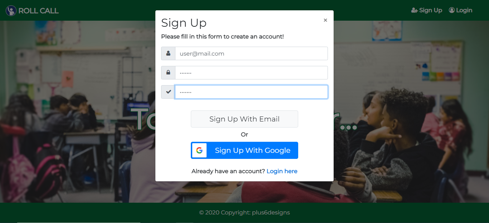
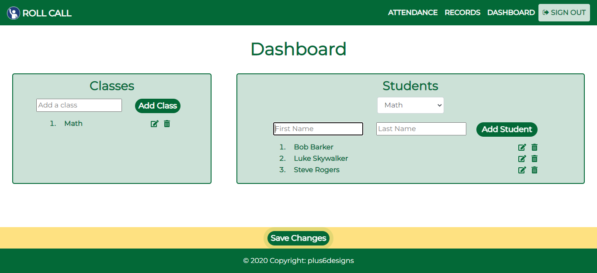
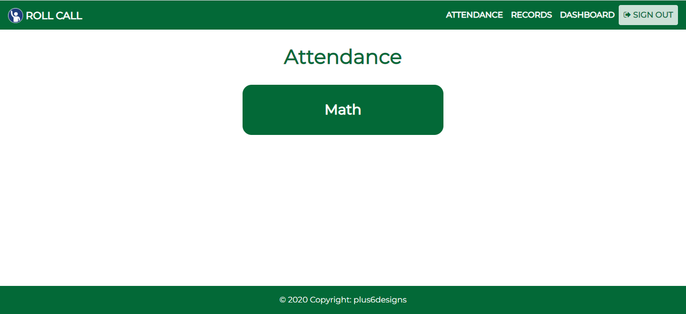
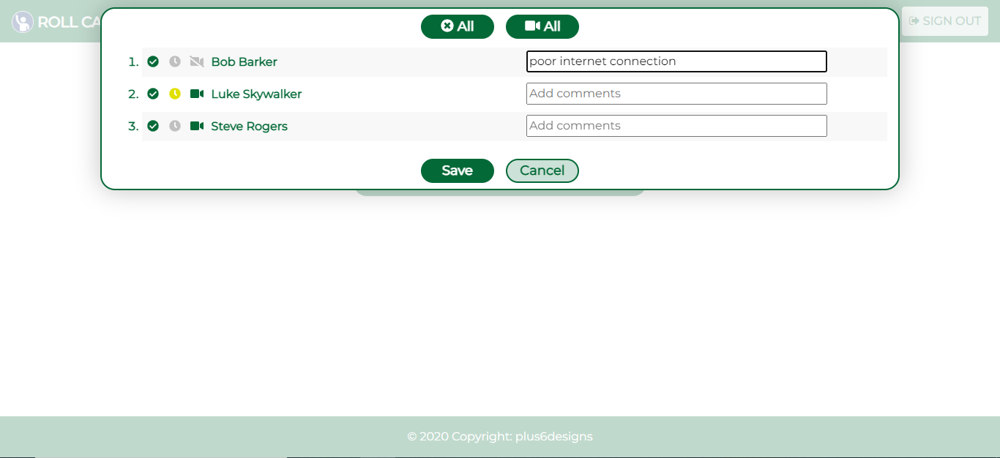
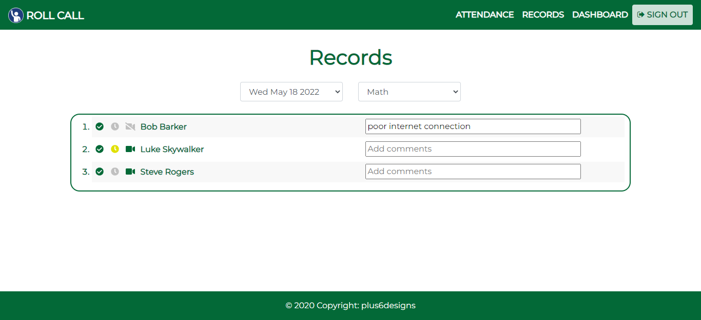

<p align="center">

</p>

<p align="center">
<h1>RollCall</h1>
<h4>Attendance tracker web app</h4>
</p>

<p align="center">
<a href="https://github.com/burrorc/RollCallReact" target="blank">

</a>
<a href="https://github.com/burrorc/RollCallReact/issues" target="blank">

</a>
<a href="https://github.com/burrorc/RollCallReact" target="blank">

</a>
</p>

<p>
<a href="https://imgbb.com/"></a>
<a href="https://ibb.co/rZnLLKq"></a>
<a href="https://ibb.co/crS3LPY"></a>
<a href="https://ibb.co/FVqrB7F"></a>
<a href="https://ibb.co/t861x7x"></a>
<a href="https://ibb.co/3fYrrMY"></a>
</p>

## 🚀 Demo

[https://rollcallrb.firebaseapp.com/](https://rollcallrb.firebaseapp.com/)

## 🛠️ Installation

1. Clone the repository by running this command in terminal

```bash
  git clone https://github.com/burrorc/RollCallReact.git
```

2. Change the working directory

```bash
cd RollCallReact
```

3. Install dependencies

```bash
npm install
```

4. Run the project locally

```bash
npm run start
```

## 🧐 How to use

1. Sign up or log in with email or google.
   <p align="center">

</p>

2. Navigate to Dashboard to add classes and students.
   <p align="center">

</p>

3. Select class from Attendance.
   <p align="center">

</p>

4. Mark attendance, tardy, camera, or add comments.
   <p align="center">

</p>

5. Navigate to Records to review or edit attendance by date and class
    <p align="center">

</p>
## 💻 Tech Stack

- HTML
- CSS
- SASS
- Bootstrap
- JavaScript
- jQuery
- React
- Firebase

## 🙇 Author

Developed with ❤️ by [@burrorc](https://github.com/burrorc)
